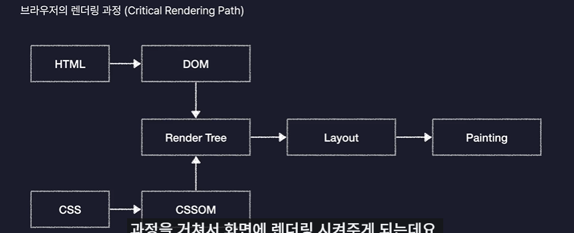
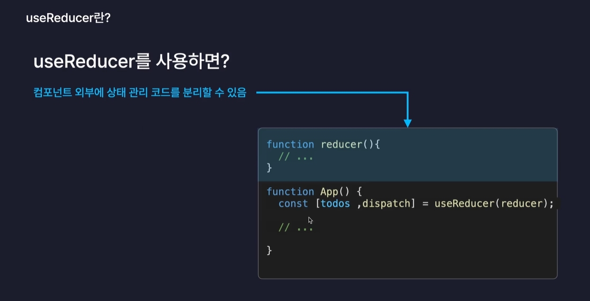
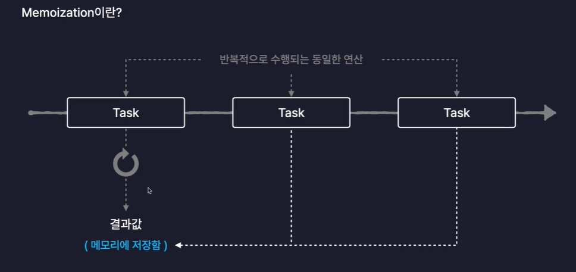
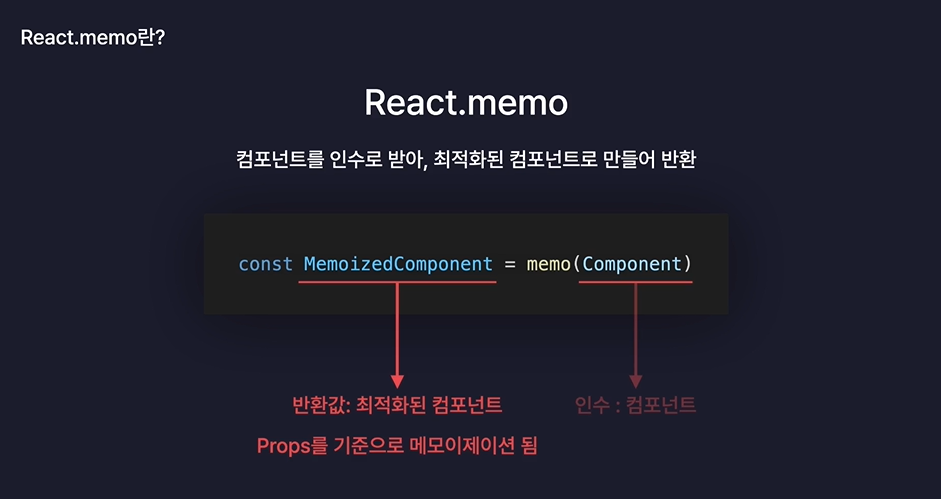

# React.js

- Meta가 개발한 오픈소스 JavaScript 라이브러리
- 대규모 웹 서비스의 UI를 더 편하게 개발하기 위해 만들어진 기술
- 넷플릭스, 페이스북, 인스타그램, 노션

## React의 기술적인 특징

1. 컴포넌트를 기반으로 UI를 표현한다.
2. 화면 업데이트 구현이 쉽다.
3. 화면 업데이트가 빠르게 처리된다.

### 컴포넌트를 기반으로 UI를 표현한다.

- 컴포넌트: 구성요소, UI를 구성하는 요소

### 화면 업데이트 구현이 쉽다.

- 업데이트: 사용자의 행동(클릭, 드래그)에 따라 웹 페이지가 스스로 모습을 바꿔 상호작용 하는 것

- 선언형 프로그래밍 : 목적만 깔끔하게 명시, 코드가 간결함(React)
  업데이트를 위한 복잡한 동작을 직접 정의할 필요 없이 특정 변수의 값을 바꾸는 것 만으로도 화면을 업데이트 시킬 수 있다.
- 명령형 프로그래밍 : 모든 과정을 하나 하나 다 설명, 코드가 길고 복잡함(js)

### 화면 업데이트가 빠르게 처리된다.

<브라우저 렌더링 과정>

DOM - Document Object Model, HTML이 자기가 더 쉽게 이해하기 위해 변환한 것. 문서 객체 모델
CSSOM = CSS Object Model. CSS코드를 브라우저가 자기가 더 이해하기 쉽도록 변환한 것
Render Tree - DOM과 CSSOM를 합쳐서 웹페이지의 청사진 혹은 설계도를 만듦. 화면에 렌더링 되어야 하는 요소들의 모든 정보가 포함.
Layout - 요소의 배치를 잡는 작업. 웹페이지라는 공간 안에 렌더트리에 포함되어 있는 요소들의 배치를 잡음.
Paintin - 실제로 화면에 그려내는 과정.

## 라이브러리

- 라이브러리: 프로그램을 개발할 때 필요한 다양한 기능들을 미리 만들어 모듈화 해 놓은 것
- npmjs.com

# 라이프 사이클

### Mount

- 컴포넌트가 탄생하는 순간
- 화면에 처음 렌더링 되는 순간
- 서버에서 데이터를 불러오는 작업

### Update

- 컴포넌트가 다시 렌더링 되는 순간
- 리렌더링 될 때를 의미
- 어떤 값이 변경되었는지 콘솔에 출력

### UnMount

- 컴포넌트가 화면에서 사라지는 순간
- 렌더링에서 제외 되는 순간을 의미
- 컴포넌트가 사용하던 메모리 정리

# useEffect

: 리액트 컴포넌트의 사이드 이펙트(부작용)를 제어하는 새로운 React Hook

- useEffect(() => {}, []) // 첫번째 인수로는 콜백함수, 두번째 인수는 배열

### 사이드 이펙트

- 리액트에서는 "부수적인 효과", "파생되는 효과" 정도로 해석 가능

## useRef 와 useState 차이점

- useRef
- 값이 변경되어도 컴포넌트가 재렌더링 되지 않음
- 초기화 후 같은 참조(current)를 유지
- DOM 요소 직접 접근
- 값 유지(렌더링 영향 없음)
  ex. 입력필드 포커스, 이전 값 저장 등

- useState
- 값이 변경되면 컴포넌트가 재렌더링됨
- 값이 변경될 때마다 새로운 상태를 가짐
- UI 상태 관리
- 값 변경 시 화면 갱신
  ex. 사용자 입력 값 관리,버튼 클릭 카운터 등

# useReducer

- 컴포넌트 내부에 새로운 State를 생성하는 React Hook
- 모든 useState는 useReducer로 대체 가능
- 상태 관리 코드를 컴포넌트 외부로 분리할 수 있음
  
  

# 최적화

- 웹 서비스의 성능을 개선하는 모든 행위

### React App 내부의 최적화 방법

- 컴포넌트 내부의 불필요한 연산 방지
- 컴포넌트 내부의 불필요한 함수 재생성 방지
- 컴포넌트의 불필요한 리렌더링 방지

# useMemo

- "메모이제이션" 기법을 기반으로 불필요한 연산을 최적화 하는 리액트 훅
  

# Memo

# Context

- 데이터 보관소(객체)
- 컴포넌트간의 데이터를 전달하는 또 다른 방법
- 기존의 props가 가지고 있던 단점을 해결할 수 있음
- props의 단점 : 부모에서 자식으로만 값을 보낼 수 있음. 자손에게 바로 전달이 안됨.
