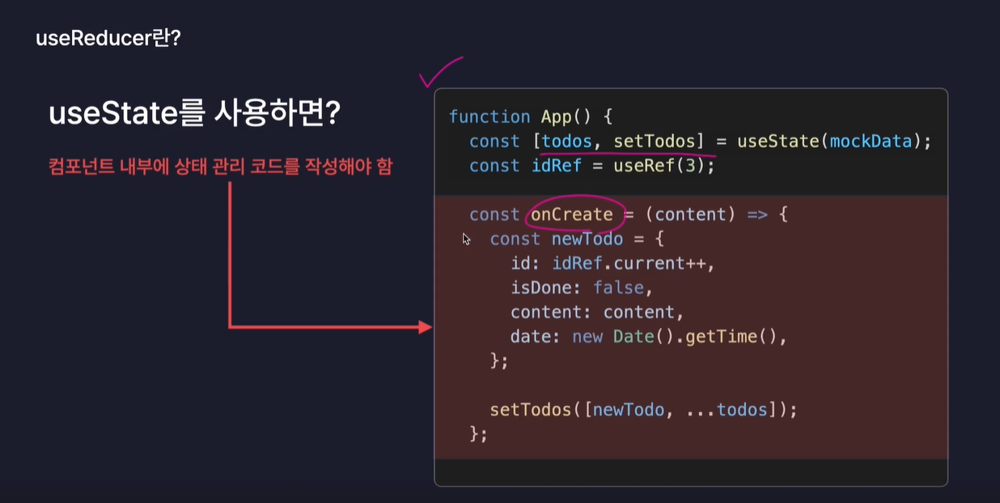

# React.js

- Meta가 개발한 오픈소스 JavaScript 라이브러리
- 대규모 웹 서비스의 UI를 더 편하게 개발하기 위해 만들어진 기술
- 넷플릭스, 페이스북, 인스타그램, 노션

## React의 기술적인 특징

1. 컴포넌트를 기반으로 UI를 표현한다.
2. 화면 업데이트 구현이 쉽다.
3. 화면 업데이트가 빠르게 처리된다.

### 컴포넌트를 기반으로 UI를 표현한다.

- 컴포넌트: 구성요소, UI를 구성하는 요소

### 화면 업데이트 구현이 쉽다.

- 업데이트: 사용자의 행동(클릭, 드래그)에 따라 웹 페이지가 스스로 모습을 바꿔 상호작용 하는 것

- 선언형 프로그래밍 : 목적만 깔끔하게 명시, 코드가 간결함(React)
  업데이트를 위한 복잡한 동작을 직접 정의할 필요 없이 특정 변수의 값을 바꾸는 것 만으로도 화면을 업데이트 시킬 수 있다.
- 명령형 프로그래밍 : 모든 과정을 하나 하나 다 설명, 코드가 길고 복잡함(js)

### 화면 업데이트가 빠르게 처리된다.

<브라우저 렌더링 과정>

DOM - Document Object Model, HTML이 자기가 더 쉽게 이해하기 위해 변환한 것. 문서 객체 모델
CSSOM = CSS Object Model. CSS코드를 브라우저가 자기가 더 이해하기 쉽도록 변환한 것
Render Tree - DOM과 CSSOM를 합쳐서 웹페이지의 청사진 혹은 설계도를 만듦. 화면에 렌더링 되어야 하는 요소들의 모든 정보가 포함.
Layout - 요소의 배치를 잡는 작업. 웹페이지라는 공간 안에 렌더트리에 포함되어 있는 요소들의 배치를 잡음.
Paintin - 실제로 화면에 그려내는 과정.

## 라이브러리

- 라이브러리: 프로그램을 개발할 때 필요한 다양한 기능들을 미리 만들어 모듈화 해 놓은 것
- npmjs.com
